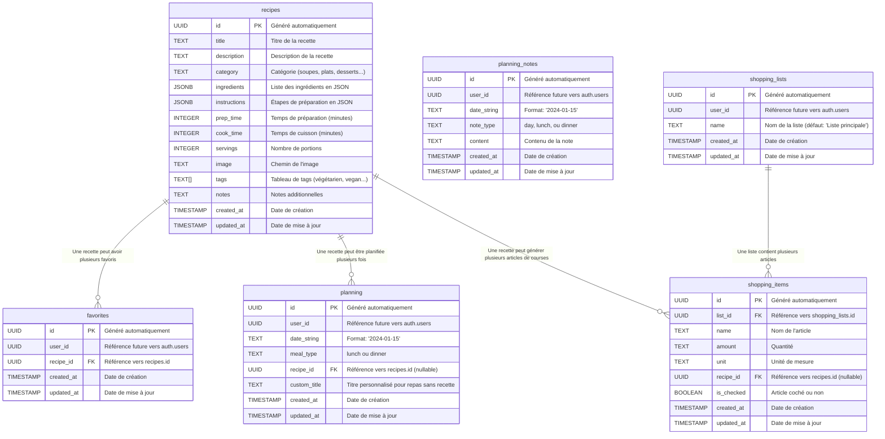

# WebApp - Recettes des Boultons

Une application web de gestion de recettes familiales, construite avec **Nuxt.js 3**, **Vue 3** et **Tailwind CSS**. Cette application permet de gérer vos recettes, planifier vos repas, organiser vos courses et bien plus encore !

## Fonctionnalités

- **Gestion des recettes** : CRUD complet avec images

- **Mode Administrateur :** Ajout, modification et suppression de recettes

- **Planification** : Planning hebdomadaire des repas
	- Ajout depuis le planning ou les fiches de recettes
	- Ajout d'éléments personnalisés (repas ou évènements) 
	- Drag and drop pour réorganiser les recettes sur le calendrier

- **Listes de courses** : Gestion des courses 
	- Ajout des ingrédients d'une recette, ou des articles personnalisés, à la liste
	- Ajout intelligent en trouvant la bonne liste et en mettant à jour les quantités
	- Possibilité de créer des listes et déplacer les articles entre les listes

- **Traducteur IA** : Conversion automatique via OpenAI
	- Depuis un copier-coller de recette, la traduire au bon format pour l'ajouter

- **Authentification** : Système JWT sécurisé

- **Internationalisation** : Support FR/EN

- **Responsive** : Design adaptatif mobile/desktop


## Architecture

  **Frontend**

- **Nuxt.js 3** : Framework Vue.js moderne avec SSR
- **Vue 3** : Composition API et réactivité avancée
- **Tailwind CSS** : Framework CSS utilitaire
- **Pinia** : Gestion d'état moderne et performante

**Backend**

- **API Nuxt** : Endpoints REST intégrés
- **JWT** : Authentification sécurisée
- **bcrypt** : Hashage des mots de passe
- **Middleware** : Sécurité et validation

**Base de Données**

- **Supabase** : Base de données PostgreSQL avec authentification
- **Row Level Security** : Sécurité au niveau des lignes
- **API REST** : Interface de programmation standardisée

**Sécurité**

- **Headers de sécurité** : Protection contre les attaques courantes
- **Validation des données** : Sanitisation des entrées
- **Rate limiting** : Protection contre les abus
- **CORS configuré** : Contrôle des origines

**Structure du Projet**

```
recettes-des-boultons/

├── components/ # Composants Vue réutilisables
│ └── ...
├── pages/ # Pages de l'application
│ └── ...
├── stores/ # Gestion d'état Pinia
│ └── ...
├── server/api/ # API backend
│ └── ...
├── i18n/ # Internationalisation
│ └── ...
├── utils/ # Utilitaires
│ └── ...
└── public/ # Fichiers publics
│ └── images/ # Images des recettes
```

## Base de Données

Tables Supabase :

- **recipes** : Recettes avec ingrédients et instructions

- **favorites** : Recettes favorites des utilisateurs
	- Relation many-to-many entre utilisateurs et recettes
	- Contrainte unique sur (user_id, recipe_id)

- **planning** : Planning hebdomadaire des repas (recettes ET repas personnalisés)
	  - Contrainte unique sur (user_id, date_string, meal_type)

- **planning_notes** : Notes générales dans le planning
  
- **shopping_lists** : Listes de courses

- **shopping_items** : Articles des listes de courses




  
Fonctionnalités Techniques :

- **Row Level Security (RLS)** activé sur toutes les tables
- **Triggers automatiques** pour la mise à jour des timestamps
- **Index optimisés** pour les requêtes fréquentes
- **Contraintes de clés étrangères** avec suppression en cascade
- **Support JSONB** pour les données flexibles (ingrédients, instructions)
- **Préparation pour l'authentification** avec les colonnes user_id

## Développement 

**Variables d'Environnement Requises :

```bash
# Configuration Supabase (obligatoire)
SUPABASE_URL=
SUPABASE_API_KEY=

# Configuration OpenAI (pour le traducteur IA)
OPENAI_API_KEY=

# Configuration d'authentification (optionnel en développement)
ADMIN_USERNAME=
ADMIN_PASSWORD=
JWT_SECRET=
```


**Démarrage :**
```bash
npm install
npm run dev
```

L'application sera accessible sur `http://localhost:3001`

**Scripts pour la production**

```bash
npm run build # Build de production
npm run start # Démarrage production
npm run generate # Génération statique
```

**Scripts de tests**
```bash
node scripts/test-supabase.js # Test de connexion Supabase
node scripts/test-tables-structure.js # Test de structure des tables
node scripts/test-apis.js # Test des APIs
```

## Déploiement

**Vercel**
- Configuration automatique via `vercel.json`
- Variables d'environnement dans l'interface Vercel
- Build automatique à chaque push

**Variables de Production**
```bash
SUPABASE_URL=
SUPABASE_API_KEY=
OPENAI_API_KEY=
NODE_ENV=production
```

L'application est accessible sur `https://recettes-des-boultons.vercel.app/`
