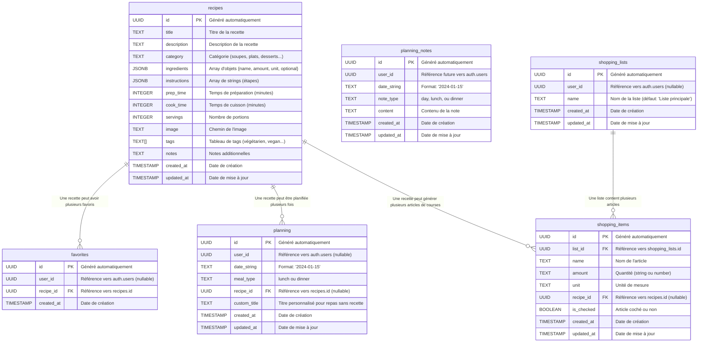

# WebApp - Recettes des Boultons

Une application web de gestion de recettes familiales, construite avec **Nuxt 4**, **Vue 3**, **Nuxt UI** et **Tailwind CSS 4**. Cette application permet de gérer vos recettes, planifier vos repas, organiser vos courses et bien plus encore !

## Fonctionnalités

- **Gestion des recettes** : CRUD complet avec images

- **Mode Administrateur :** Ajout, modification et suppression de recettes

- **Planification** : Planning hebdomadaire des repas
	- Ajout depuis le planning ou les fiches de recettes
	- Ajout d'éléments personnalisés (repas ou évènements) 
	- Drag and drop pour réorganiser les recettes sur le calendrier

- **Listes de courses** : Gestion des courses 
	- Ajout des ingrédients d'une recette, ou des articles personnalisés, à la liste
	- Ajout intelligent en trouvant la bonne liste et en mettant à jour les quantités
	- Possibilité de créer des listes et déplacer les articles entre les listes

- **Traducteur IA** : Conversion automatique via OpenAI
	- Depuis un copier-coller de recette, la traduire au bon format pour l'ajouter

- **Authentification** : Supabase Auth (session en cookie, rôles `user` / `admin`)

- **Internationalisation** : Support FR/EN

- **Responsive** : Design adaptatif mobile/desktop


## Architecture

  **Frontend**

- **Nuxt 4** : Framework Vue.js moderne avec SSR (structure `app/` + `shared/`)
- **Vue 3** : Composition API et réactivité avancée
- **Nuxt UI v4 + Tailwind CSS 4** : composants et utilitaires CSS (palette maison `primary` / `secondary`)
- **Pinia 3** : Gestion d'état moderne et performante
- **@nuxt/image, @nuxt/fonts, @nuxtjs/i18n** : images optimisées, polices (Lobster, Poppins), FR/EN

**Backend**

- **API Nuxt (Nitro)** : Endpoints REST intégrés (`server/api/`)
- **Supabase Auth via `@nuxtjs/supabase`** : un seul client, session portée par un cookie, lue côté serveur
- **Gardes serveur** : `requireUser` / `requireAdmin` + validation des entrées

**Base de Données**

- **Supabase** : Base de données PostgreSQL avec authentification
- **Row Level Security** : Sécurité au niveau des lignes
- **API REST** : Interface de programmation standardisée

**Sécurité**

- **Headers de sécurité** : Protection contre les attaques courantes
- **Validation des données** : Sanitisation des entrées
- **Rate limiting** : Protection contre les abus
- **CORS configuré** : Contrôle des origines

**Structure du Projet**

```
recettes-des-boultons/
├── app/                 # Code applicatif (Nuxt 4)
│   ├── app.vue, app.config.ts
│   ├── pages/           # Pages de l'application
│   ├── components/      # Composants Vue réutilisables
│   ├── layouts/, middleware/, plugins/, composables/
│   ├── stores/          # Gestion d'état Pinia
│   └── assets/css/      # main.css (Tailwind 4 + Nuxt UI + thème)
├── shared/              # Code partagé client/serveur (types, utils)
├── server/api/          # API backend (Nitro)
├── i18n/locales/        # Internationalisation (fr.json, en.json)
├── supabase/migrations/ # Migrations SQL
├── test/                # Tests Vitest
└── public/images/       # Fichiers publics / images des recettes
```

## Base de Données

Tables Supabase :

- **recipes** : Recettes avec ingrédients et instructions
	- Structure JSONB pour ingredients et instructions
	- Support des tags et notes

- **favorites** : Recettes favorites des utilisateurs
	- Relation many-to-many entre utilisateurs et recettes
	- Contrainte unique sur (user_id, recipe_id)

- **planning** : Planning hebdomadaire des repas (recettes ET repas personnalisés)
	- Support des repas avec recettes ou titres personnalisés
	- Contrainte unique sur (user_id, date_string, meal_type)

- **shopping_lists** : Listes de courses
	- Gestion multi-listes par utilisateur

- **shopping_items** : Articles des listes de courses
	- Support des quantités flexibles (string/number)
	- Liaison avec les recettes pour traçabilité



```mermaid
erDiagram
    %% Table principale des recettes
    recipes {
        UUID id PK "Généré automatiquement"
        TEXT title "Titre de la recette"
        TEXT description "Description de la recette"
        TEXT category "Catégorie (soupes, plats, desserts...)"
        JSONB ingredients "Array d'objets {name, amount, unit, optional}"
        JSONB instructions "Array de strings (étapes)"
        INTEGER prep_time "Temps de préparation (minutes)"
        INTEGER cook_time "Temps de cuisson (minutes)"
        INTEGER servings "Nombre de portions"
        TEXT image "Chemin de l'image"
        TEXT[] tags "Tableau de tags (végétarien, vegan...)"
        TEXT notes "Notes additionnelles"
        TIMESTAMP created_at "Date de création"
        TIMESTAMP updated_at "Date de mise à jour"
    }

    %% Table des favoris
    favorites {
        UUID id PK "Généré automatiquement"
        UUID user_id "Référence vers auth.users (nullable)"
        UUID recipe_id FK "Référence vers recipes.id"
        TIMESTAMP created_at "Date de création"
    }

    %% Table du planning hebdomadaire
    planning {
        UUID id PK "Généré automatiquement"
        UUID user_id "Référence vers auth.users (nullable)"
        TEXT date_string "Format: '2024-01-15'"
        TEXT meal_type "lunch ou dinner"
        UUID recipe_id FK "Référence vers recipes.id (nullable)"
        TEXT custom_title "Titre personnalisé pour repas sans recette"
        TIMESTAMP created_at "Date de création"
        TIMESTAMP updated_at "Date de mise à jour"
    }

    %% Table des notes du planning
    planning_notes {
        UUID id PK "Généré automatiquement"
        UUID user_id "Référence future vers auth.users"
        TEXT date_string "Format: '2024-01-15'"
        TEXT note_type "day, lunch, ou dinner"
        TEXT content "Contenu de la note"
        TIMESTAMP created_at "Date de création"
        TIMESTAMP updated_at "Date de mise à jour"
    }

    %% Table des listes de courses
    shopping_lists {
        UUID id PK "Généré automatiquement"
        UUID user_id "Référence vers auth.users (nullable)"
        TEXT name "Nom de la liste (défaut: 'Liste principale')"
        TIMESTAMP created_at "Date de création"
        TIMESTAMP updated_at "Date de mise à jour"
    }

    %% Table des articles de courses
    shopping_items {
        UUID id PK "Généré automatiquement"
        UUID list_id FK "Référence vers shopping_lists.id"
        TEXT name "Nom de l'article"
        TEXT amount "Quantité (string ou number)"
        TEXT unit "Unité de mesure"
        UUID recipe_id FK "Référence vers recipes.id (nullable)"
        BOOLEAN is_checked "Article coché ou non"
        TIMESTAMP created_at "Date de création"
        TIMESTAMP updated_at "Date de mise à jour"
    }

    %% Relations entre les tables
    recipes ||--o{ favorites : "Une recette peut avoir plusieurs favoris"
    recipes ||--o{ planning : "Une recette peut être planifiée plusieurs fois"
    recipes ||--o{ shopping_items : "Une recette peut générer plusieurs articles de courses"
    shopping_lists ||--o{ shopping_items : "Une liste contient plusieurs articles"

    %% Contraintes et index
    %% - RLS activé sur toutes les tables
    %% - Triggers automatiques pour updated_at
    %% - Index sur les colonnes fréquemment utilisées
    %% - Contraintes de clés étrangères avec suppression en cascade
```

  
Fonctionnalités Techniques :

- **Row Level Security (RLS)** activé sur toutes les tables
- **Triggers automatiques** pour la mise à jour des timestamps
- **Index optimisés** pour les requêtes fréquentes
- **Contraintes de clés étrangères** avec suppression en cascade
- **Support JSONB** pour les données flexibles (ingrédients, instructions)
- **Préparation pour l'authentification** avec les colonnes user_id

## Développement 

**Variables d'Environnement Requises :**

```bash
# Configuration Supabase (obligatoire) — voir env.example
SUPABASE_URL=
SUPABASE_ANON_KEY=

# Configuration OpenAI (pour le traducteur IA)
OPENAI_API_KEY=
```

**Démarrage :** (Node 22, voir `.nvmrc`)
```bash
npm install
npm run dev
```

L'application sera accessible sur `http://localhost:3001`

**Scripts**

```bash
npm run build      # Build de production (preset Vercel)
npm run start      # Démarrage production
npm run lint       # ESLint (config Nuxt)
npm run typecheck  # vue-tsc (TypeScript strict)
npm test           # Vitest
```

L'intégration continue (`.github/workflows/ci.yml`) exécute lint, typecheck, test et build à chaque push / pull request.

## Déploiement

**Vercel**
- Configuration automatique via `vercel.json`
- Variables d'environnement dans l'interface Vercel
- Build automatique à chaque push

**Variables de Production**
```bash
SUPABASE_URL=
SUPABASE_ANON_KEY=
OPENAI_API_KEY=
NODE_ENV=production
```

L'application est accessible sur `https://recettes-des-boultons.vercel.app/`